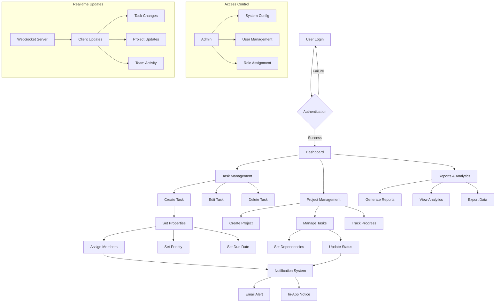
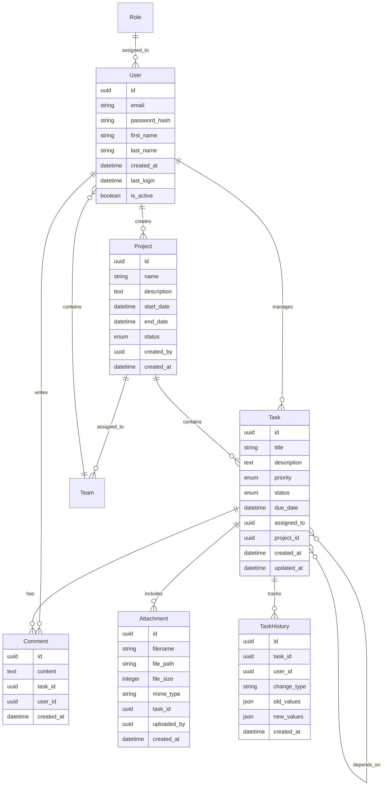
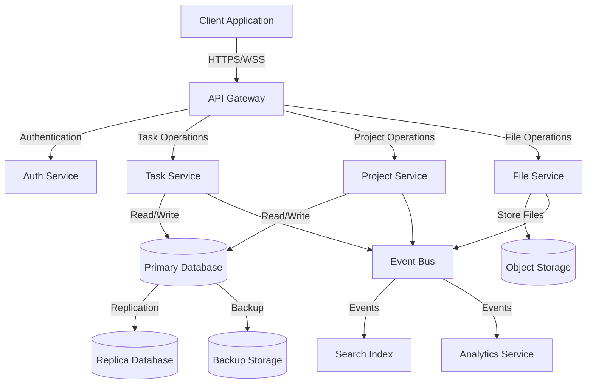
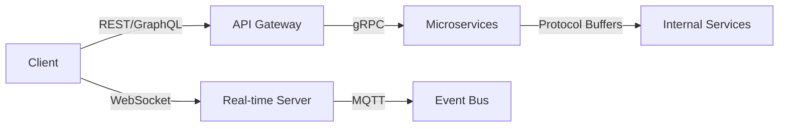

# Product Requirements Document (PRD)

# 1. INTRODUCTION

## 1.1 Purpose
This Software Requirements Specification (SRS) document provides a comprehensive description of the Task Management System. It details the functional and non-functional requirements for the development team, project stakeholders, and quality assurance team. The document serves as the primary reference for technical and non-technical audiences to understand the system's intended behavior, constraints, and performance expectations.

## 1.2 Scope
The Task Management System is a web-based application designed to streamline task organization and team collaboration. The system encompasses:

- Task Creation and Management
  - Create, edit, and delete tasks
  - Assign due dates, priorities, and team members
  - Track task status and progress
  - Attach files and documents

- Project Organization
  - Categorize tasks into projects
  - Set project hierarchies and dependencies
  - Monitor project timelines and milestones

- Team Collaboration
  - Real-time updates and notifications
  - Comment threads on tasks
  - File sharing capabilities
  - Team member availability tracking

- Access Control
  - Role-based permissions (Admin, Manager, Team Member)
  - User authentication and authorization
  - Secure data access

- Reporting and Analytics
  - Task completion metrics
  - Team productivity reports
  - Project progress tracking
  - Custom dashboard views

The system will improve team efficiency, enhance communication, and provide clear visibility into project progress while maintaining data security and user privacy.

# 2. PRODUCT DESCRIPTION

## 2.1 Product Perspective
The Task Management System operates as a standalone web application while integrating with existing enterprise systems and services:

- Browser-based interface accessible across desktop and mobile devices
- Cloud-hosted solution with distributed architecture
- Integration capabilities with:
  - Email systems for notifications
  - Calendar applications for deadline synchronization
  - Cloud storage services for file attachments
  - Single Sign-On (SSO) systems for enterprise authentication
  - Third-party messaging platforms for notifications

## 2.2 Product Functions
The system provides the following core functions:

| Function Category | Key Features |
|------------------|--------------|
| Task Management | - Task creation and modification - Priority and status assignment - Due date management - Progress tracking - File attachments |
| Project Organization | - Project hierarchy creation - Task grouping and categorization - Milestone tracking - Dependencies management |
| Collaboration | - Real-time updates - Comment threads - @mentions and notifications - Shared workspaces |
| User Management | - Role-based access control - Team management - User profiles - Activity tracking |
| Reporting | - Performance analytics - Progress reports - Time tracking - Custom dashboards |

## 2.3 User Characteristics

### Administrator
- IT professionals with system administration experience
- Responsible for system configuration, user management, and security
- Requires technical knowledge of system administration and security protocols

### Project Manager
- Professional project management background
- Needs comprehensive view of projects and team performance
- Focuses on resource allocation and progress monitoring

### Team Member
- Various technical skill levels
- Primary focus on task execution and updates
- Requires intuitive interface for daily task management

### Individual User
- May have limited technical expertise
- Uses system for personal task organization
- Needs simple, straightforward functionality

## 2.4 Constraints

1. Technical Constraints
   - Must support modern web browsers (Chrome, Firefox, Safari, Edge)
   - Maximum file attachment size of 25MB
   - Response time under 2 seconds for standard operations
   - 99.9% system availability

2. Regulatory Constraints
   - GDPR compliance for EU users
   - Data privacy regulations compliance
   - Secure data storage and transmission
   - Regular security audits

3. Business Constraints
   - Must integrate with existing enterprise systems
   - Support for minimum 10,000 concurrent users
   - Mobile-responsive design requirement
   - Multi-language support requirement

## 2.5 Assumptions and Dependencies

### Assumptions
1. Users have stable internet connectivity
2. Modern web browser availability
3. Basic computer literacy of users
4. Email access for notifications
5. Device compatibility with modern web standards

### Dependencies
1. Cloud infrastructure availability
2. Third-party service reliability:
   - Email service providers
   - Cloud storage services
   - Authentication services
3. Browser compatibility with WebSocket for real-time updates
4. Database management system performance
5. Network bandwidth and latency requirements

# 3. PROCESS FLOWCHART

# 4. FUNCTIONAL REQUIREMENTS

## 4.1 User Authentication and Authorization

### ID: FR-101
### Description
User authentication and access control system managing login, permissions, and security.
### Priority: High
### Requirements

| ID | Requirement | Priority |
|---|-------------|----------|
| FR-101.1 | System shall support email/password authentication | High |
| FR-101.2 | System shall implement role-based access control (Admin, Manager, Team Member) | High |
| FR-101.3 | System shall provide password reset functionality | Medium |
| FR-101.4 | System shall support Single Sign-On (SSO) integration | Medium |
| FR-101.5 | System shall maintain audit logs of authentication attempts | High |

## 4.2 Task Management

### ID: FR-102
### Description
Core task creation, editing, and management functionality.
### Priority: High
### Requirements

| ID | Requirement | Priority |
|---|-------------|----------|
| FR-102.1 | System shall allow creation of tasks with title, description, and due date | High |
| FR-102.2 | System shall support task priority levels (Low, Medium, High, Urgent) | High |
| FR-102.3 | System shall enable file attachments up to 25MB per task | Medium |
| FR-102.4 | System shall provide task status tracking (To Do, In Progress, Done) | High |
| FR-102.5 | System shall support task dependencies and subtasks | Medium |

## 4.3 Project Organization

### ID: FR-103
### Description
Project structure and hierarchy management capabilities.
### Priority: High
### Requirements

| ID | Requirement | Priority |
|---|-------------|----------|
| FR-103.1 | System shall support project creation and organization | High |
| FR-103.2 | System shall allow grouping of tasks within projects | High |
| FR-103.3 | System shall track project milestones and deadlines | Medium |
| FR-103.4 | System shall support project templates | Low |
| FR-103.5 | System shall enable project archiving | Low |

## 4.4 Collaboration Features

### ID: FR-104
### Description
Team collaboration and communication functionality.
### Priority: High
### Requirements

| ID | Requirement | Priority |
|---|-------------|----------|
| FR-104.1 | System shall provide real-time updates via WebSocket | High |
| FR-104.2 | System shall support comment threads on tasks | High |
| FR-104.3 | System shall implement @mentions functionality | Medium |
| FR-104.4 | System shall send email notifications for task assignments | High |
| FR-104.5 | System shall support team member availability status | Medium |

## 4.5 Reporting and Analytics

### ID: FR-105
### Description
Data analysis and reporting capabilities.
### Priority: Medium
### Requirements

| ID | Requirement | Priority |
|---|-------------|----------|
| FR-105.1 | System shall generate task completion reports | Medium |
| FR-105.2 | System shall provide team productivity metrics | Medium |
| FR-105.3 | System shall support custom dashboard creation | Low |
| FR-105.4 | System shall enable data export in CSV format | Medium |
| FR-105.5 | System shall track time spent on tasks | Medium |

## 4.6 Integration Capabilities

### ID: FR-106
### Description
External system integration features.
### Priority: Medium
### Requirements

| ID | Requirement | Priority |
|---|-------------|----------|
| FR-106.1 | System shall integrate with calendar applications | Medium |
| FR-106.2 | System shall support cloud storage service integration | Medium |
| FR-106.3 | System shall enable email system integration | High |
| FR-106.4 | System shall support API access for external systems | Medium |
| FR-106.5 | System shall allow webhook configurations | Low |

# 5. NON-FUNCTIONAL REQUIREMENTS

## 5.1 Performance Requirements

| ID | Requirement | Target Metric |
|---|-------------|---------------|
| NFR-101 | Page load time | < 2 seconds for 90% of requests |
| NFR-102 | API response time | < 500ms for 95% of requests |
| NFR-103 | Maximum concurrent users | 10,000 users |
| NFR-104 | Database query execution | < 100ms for 95% of queries |
| NFR-105 | WebSocket message delivery | < 100ms latency |
| NFR-106 | File upload processing | < 5 seconds for 25MB files |
| NFR-107 | Report generation time | < 30 seconds for complex reports |

## 5.2 Safety Requirements

| ID | Requirement | Description |
|---|-------------|-------------|
| NFR-201 | Data Backup | Automated daily backups with 30-day retention |
| NFR-202 | Disaster Recovery | Recovery Time Objective (RTO) of 4 hours |
| NFR-203 | Data Loss Prevention | Recovery Point Objective (RPO) of 1 hour |
| NFR-204 | Failover System | Automatic failover to secondary systems |
| NFR-205 | Error Handling | Graceful degradation of non-critical features |
| NFR-206 | Session Management | Automatic session timeout after 30 minutes |
| NFR-207 | Data Validation | Input validation for all user-submitted data |

## 5.3 Security Requirements

| ID | Requirement | Description |
|---|-------------|-------------|
| NFR-301 | Authentication | Multi-factor authentication support |
| NFR-302 | Data Encryption | AES-256 encryption for data at rest |
| NFR-303 | Communication Security | TLS 1.3 for all data in transit |
| NFR-304 | Access Control | Role-based access control (RBAC) |
| NFR-305 | Password Policy | Minimum 12 characters with complexity requirements |
| NFR-306 | Audit Logging | Comprehensive logging of all security events |
| NFR-307 | Vulnerability Scanning | Weekly automated security scans |
| NFR-308 | API Security | OAuth 2.0 and JWT implementation |

## 5.4 Quality Requirements

### 5.4.1 Availability
- System uptime of 99.9% (excluding planned maintenance)
- Maximum planned downtime of 4 hours per month
- 24/7 monitoring and alert system

### 5.4.2 Maintainability
- Modular architecture for easy component updates
- Comprehensive API documentation
- Automated deployment pipeline
- Code coverage minimum of 80%

### 5.4.3 Usability
- Intuitive interface requiring minimal training
- Maximum of 3 clicks to reach any feature
- Support for multiple languages
- Responsive design for all screen sizes
- WCAG 2.1 Level AA compliance

### 5.4.4 Scalability
- Horizontal scaling capability
- Auto-scaling based on load metrics
- Database partitioning support
- Microservices architecture support

### 5.4.5 Reliability
- Mean Time Between Failures (MTBF) > 720 hours
- Mean Time To Recovery (MTTR) < 1 hour
- Zero data loss during system failures
- Automated system health checks

## 5.5 Compliance Requirements

| ID | Requirement | Description |
|---|-------------|-------------|
| NFR-501 | GDPR Compliance | Full compliance with EU data protection regulations |
| NFR-502 | CCPA Compliance | California Consumer Privacy Act compliance |
| NFR-503 | SOC 2 Type II | Annual SOC 2 Type II certification |
| NFR-504 | ISO 27001 | Information security management compliance |
| NFR-505 | WCAG 2.1 | Web Content Accessibility Guidelines compliance |
| NFR-506 | Data Retention | Configurable data retention policies |
| NFR-507 | Privacy Policy | Clear and accessible privacy policy |
| NFR-508 | Audit Trail | Complete audit trail for compliance reporting |

# 6. DATA REQUIREMENTS

## 6.1 Data Models

## 6.2 Data Storage

### 6.2.1 Primary Storage
- PostgreSQL database cluster for structured data
- Document store (MongoDB) for unstructured data and activity logs
- Object storage (S3-compatible) for file attachments

### 6.2.2 Data Retention
| Data Type | Retention Period | Archive Policy |
|-----------|------------------|----------------|
| Active Tasks | Indefinite | None |
| Completed Tasks | 3 years | After 1 year |
| Comments | 3 years | After 1 year |
| Attachments | 3 years | After 1 year |
| Audit Logs | 7 years | After 2 years |
| User Data | Account lifetime + 1 year | Upon account deletion |

### 6.2.3 Backup Strategy
- Full daily backups with 30-day retention
- Point-in-time recovery using transaction logs
- Cross-region backup replication
- Monthly backup verification and restoration testing

### 6.2.4 Data Redundancy
- Multi-AZ database deployment
- Real-time synchronous replication
- Read replicas for load distribution
- Geographic redundancy for disaster recovery

## 6.3 Data Processing

### 6.3.1 Data Flow

### 6.3.2 Data Security
| Layer | Security Measure |
|-------|-----------------|
| Transport | TLS 1.3 encryption |
| Storage | AES-256 encryption at rest |
| Application | Field-level encryption for sensitive data |
| Database | Row-level security policies |
| Backup | Encrypted backup files |
| Files | Client-side encryption for attachments |

### 6.3.3 Data Processing Requirements
- Real-time task updates via WebSocket
- Asynchronous processing for file uploads
- Batch processing for analytics and reports
- Event-driven architecture for system integrations
- Data validation and sanitization at API boundaries
- Rate limiting and request throttling
- Caching strategy for frequently accessed data

# 7. EXTERNAL INTERFACES

## 7.1 User Interfaces

### 7.1.1 Web Application Interface
- Responsive design supporting viewport sizes from 320px to 4K displays
- Material Design 3 component library implementation
- Minimum touch target size of 44x44 pixels for mobile interfaces
- Maximum content width of 1440px with responsive breakpoints at:
  - Mobile: 320px - 767px
  - Tablet: 768px - 1023px
  - Desktop: 1024px - 1440px
  - Large Desktop: > 1440px

### 7.1.2 Key Interface Components

| Component | Requirements |
|-----------|--------------|
| Navigation | - Persistent top navigation bar - Collapsible side menu for project navigation - Breadcrumb trail for deep navigation |
| Task Lists | - Sortable columns - Drag-and-drop reordering - Infinite scroll with virtual rendering - Quick action buttons |
| Forms | - Inline validation - Auto-save functionality - Progressive disclosure of complex options - Keyboard navigation support |
| Notifications | - Toast messages for system alerts - Badge indicators for unread items - Modal dialogs for confirmations |
| Dashboard | - Customizable widget layout - Interactive charts and graphs - Real-time status updates |

## 7.2 Hardware Interfaces

### 7.2.1 Client Devices
- Support for standard input devices (keyboard, mouse, touch)
- Camera access for document scanning and attachments
- Local storage access for offline capabilities
- Microphone access for voice notes (optional)

### 7.2.2 Server Infrastructure
- Load balancer interface specifications
- Storage system interfaces (SAN/NAS)
- Backup system connectivity requirements
- Network interface requirements:
  - 10Gbps minimum network interface cards
  - Redundant network paths
  - Support for jumbo frames

## 7.3 Software Interfaces

### 7.3.1 External Service Integration

| Service Type | Interface Specification |
|--------------|------------------------|
| Email Service | - SMTP/IMAP protocols - OAuth 2.0 authentication - Support for HTML email templates |
| Calendar Systems | - CalDAV protocol support - iCal format compatibility - Two-way synchronization |
| Storage Services | - S3-compatible API - WebDAV protocol support - Chunk upload capability |
| Authentication | - OAuth 2.0/OpenID Connect - SAML 2.0 for SSO - LDAP/Active Directory integration |

### 7.3.2 Database Interfaces
- PostgreSQL wire protocol (version 14+)
- MongoDB wire protocol (version 5+)
- Redis protocol for caching
- Elasticsearch REST API for search functionality

### 7.3.3 Operating System Interfaces
- Linux kernel API (version 5.x+)
- Container runtime interface (Docker/containerd)
- File system access (ext4, xfs)
- System logging interface (syslog, journald)

## 7.4 Communication Interfaces

### 7.4.1 Network Protocols

| Protocol | Usage | Specification |
|----------|--------|---------------|
| HTTPS | REST API | TLS 1.3, HTTP/2 |
| WebSocket | Real-time Updates | WSS, RFC 6455 |
| gRPC | Service Communication | HTTP/2, Protocol Buffers |
| MQTT | Event Broadcasting | v5.0, QoS Level 1 |

### 7.4.2 API Specifications

### 7.4.3 Data Exchange Formats
- JSON for REST API responses
- Protocol Buffers for internal service communication
- MessagePack for WebSocket messages
- JWT for authentication tokens
- CSV/Excel for data exports

# 8. APPENDICES

## 8.1 GLOSSARY

| Term | Definition |
|------|------------|
| Milestone | A significant point or event in a project timeline |
| Sprint | A fixed time period during which specific work must be completed |
| Burndown Chart | A graphical representation of work left to do versus time |
| Kanban Board | A visual tool for managing work items and workflow |
| Dependency | A task that must be completed before another can begin |
| Story Points | A metric used to estimate the difficulty of implementing a task |
| Backlog | A prioritized list of tasks that haven't been started yet |
| Epic | A large body of work that can be broken down into smaller tasks |
| Velocity | The amount of work a team can complete in a given time period |
| Webhook | An automated message sent to a URL when an event occurs |

## 8.2 ACRONYMS

| Acronym | Definition |
|---------|------------|
| API | Application Programming Interface |
| RBAC | Role-Based Access Control |
| SSO | Single Sign-On |
| JWT | JSON Web Token |
| CRUD | Create, Read, Update, Delete |
| REST | Representational State Transfer |
| WSS | WebSocket Secure |
| SMTP | Simple Mail Transfer Protocol |
| IMAP | Internet Message Access Protocol |
| TLS | Transport Layer Security |
| MTBF | Mean Time Between Failures |
| MTTR | Mean Time To Recovery |
| RPO | Recovery Point Objective |
| RTO | Recovery Time Objective |
| SAN | Storage Area Network |
| NAS | Network Attached Storage |

## 8.3 ADDITIONAL REFERENCES

| Reference | Description | URL |
|-----------|-------------|-----|
| Material Design 3 | UI component design system | https://m3.material.io/ |
| WebSocket Protocol | RFC 6455 specification | https://tools.ietf.org/html/rfc6455 |
| OAuth 2.0 | Authorization framework specification | https://oauth.net/2/ |
| WCAG 2.1 | Web accessibility guidelines | https://www.w3.org/WAI/WCAG21/Understanding/ |
| PostgreSQL Documentation | Database technical reference | https://www.postgresql.org/docs/ |
| Docker Documentation | Container platform documentation | https://docs.docker.com/ |
| Redis Documentation | Caching system reference | https://redis.io/documentation |
| Elasticsearch Guide | Search engine documentation | https://www.elastic.co/guide/ |