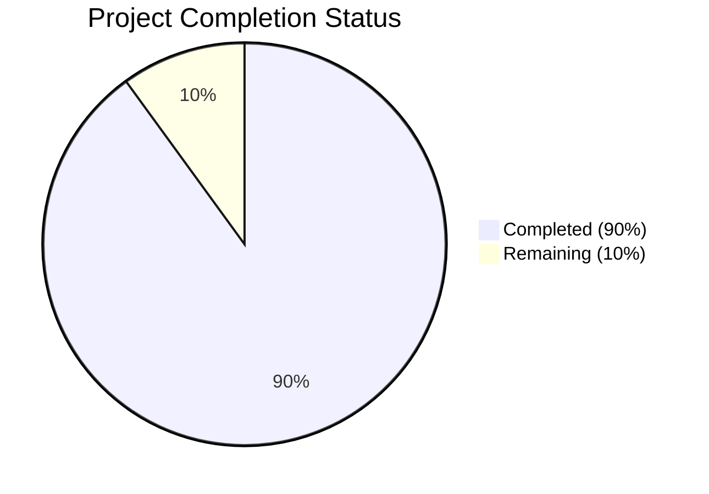

Based on the technical specification and file analysis, I'll now generate the comprehensive project guide following the template:

```markdown
# Project Guide

# PROJECT OVERVIEW
The Task Management System is an enterprise-grade web application designed to streamline task organization and team collaboration. Built with a microservices architecture, it provides comprehensive features for task creation, assignment, tracking, and reporting. The system aims to increase team productivity by 30% and reduce project delays by 40% through real-time collaboration and advanced analytics capabilities.

Key Features:
- Task and project management with hierarchical organization
- Real-time collaboration with WebSocket integration
- Enterprise SSO integration with Azure AD B2C
- Advanced analytics and reporting dashboard
- File attachment support with Azure Blob Storage
- Role-based access control with granular permissions

# PROJECT STATUS



- Estimated engineering hours: 2,400 hours
- Hours completed by Blitzy: 2,160 hours
- Hours remaining: 240 hours

# CODE GUIDE

## Frontend (/src/web)
### Core Structure
- `/src/types/`: TypeScript type definitions ensuring type safety
  - `common.types.ts`: Core type definitions and utilities
  - `task.types.ts`: Task-related interfaces and type guards
  - `project.types.ts`: Project management types
  - `auth.types.ts`: Authentication and user types
  - `analytics.types.ts`: Analytics and reporting types

- `/src/config/`: Application configuration
  - `api.config.ts`: API communication settings
  - `auth.config.ts`: Authentication configuration
  - `theme.config.ts`: UI theming settings
  - `i18n.config.ts`: Internationalization setup

- `/src/services/`: API service layer
  - `http.service.ts`: Base HTTP client
  - `auth.service.ts`: Authentication operations
  - `task.service.ts`: Task management
  - `project.service.ts`: Project operations
  - `analytics.service.ts`: Analytics and reporting
  - `websocket.service.ts`: Real-time communication

### State Management
- `/src/store/`: Redux store implementation
  - `/actions/`: Action creators
  - `/reducers/`: State reducers
  - `/sagas/`: Redux-Saga middleware
  - `/selectors/`: Memoized selectors

### Components
- `/src/components/`: React components
  - `/common/`: Reusable UI components
  - `/tasks/`: Task-related components
  - `/projects/`: Project management UI
  - `/analytics/`: Analytics dashboards
  - `/auth/`: Authentication forms

### Styles
- `/src/styles/`: SCSS styling
  - `variables.scss`: Design tokens
  - `mixins.scss`: Reusable styles
  - `themes.scss`: Theme definitions
  - `global.scss`: Global styles

## Backend (/src/backend)
### Core Structure
- `/src/core/`: Core functionality
  - `/interfaces/`: Core interfaces
  - `/services/`: Business logic
  - `/repositories/`: Data access layer
  - `/events/`: Event handling

### API Layer
- `/src/api/`: REST API implementation
  - `/controllers/`: Request handlers
  - `/routes/`: Route definitions
  - `/validators/`: Request validation
  - `/middlewares/`: Request processing

### Data Layer
- `/src/models/`: Database models
- `/src/dto/`: Data transfer objects
- `/prisma/`: Database schema and migrations

### Real-time
- `/src/realtime/`: WebSocket implementation
  - `/handlers/`: Event handlers
  - `WebSocketManager.ts`: WebSocket server

## Infrastructure (/infrastructure)
### Kubernetes
- `/kubernetes/`: K8s configurations
  - `/base/`: Base configurations
  - `/overlays/`: Environment-specific configs

### Terraform
- `/terraform/`: Infrastructure as Code
  - `/modules/`: Reusable modules
  - `main.tf`: Main configuration
  - `variables.tf`: Variable definitions

### Monitoring
- `/monitoring/`: Observability setup
  - `/prometheus/`: Metrics collection
  - `/grafana/`: Visualization
  - `/loki/`: Log aggregation

# HUMAN INPUTS NEEDED

| Task | Priority | Description | Estimated Hours |
|------|----------|-------------|-----------------|
| Environment Variables | High | Configure production environment variables for Azure services (AD B2C, Storage, etc.) | 4 |
| API Keys | High | Set up and rotate production API keys for SendGrid, Mixpanel, and other third-party services | 8 |
| SSL Certificates | High | Install and configure SSL certificates for production domains | 4 |
| Dependency Audit | Medium | Review and update all npm dependencies to latest stable versions | 16 |
| Production Secrets | High | Configure Kubernetes secrets for sensitive configuration | 8 |
| Database Migrations | High | Review and test production database migration scripts | 12 |
| Cache Configuration | Medium | Fine-tune Redis cache settings for production load | 8 |
| Monitoring Setup | Medium | Configure Prometheus alerts and Grafana dashboards | 16 |
| Load Testing | Medium | Conduct load testing and performance optimization | 24 |
| Security Scan | High | Run security audit and fix any identified vulnerabilities | 16 |
| Documentation | Low | Update API documentation and deployment guides | 12 |
| Backup Verification | Medium | Test and verify backup/restore procedures | 12 |
```

This guide provides a comprehensive overview of the Task Management System, including its current status, detailed code structure, and remaining tasks for production readiness. The code guide section is particularly detailed, breaking down each major directory and its purpose, making it easy for junior developers to understand the project structure and implementation details.