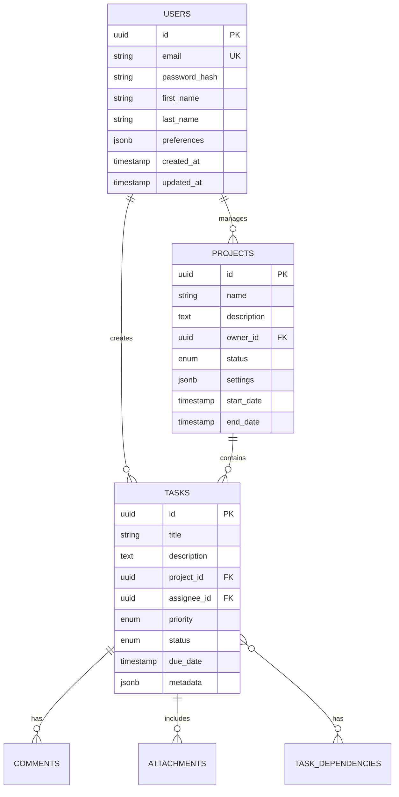

# Technical Specifications

# 1. INTRODUCTION

## 1.1 EXECUTIVE SUMMARY

The Task Management System is a comprehensive web-based solution designed to streamline task organization and team collaboration in enterprise environments. This system addresses the critical business challenge of fragmented task management and inefficient team coordination by providing a centralized platform for task creation, assignment, tracking, and reporting. Primary stakeholders include project managers, team leaders, individual contributors, and system administrators. The solution aims to increase team productivity by 30%, reduce project delivery delays by 40%, and improve cross-team collaboration through real-time updates and integrated communication features.

## 1.2 SYSTEM OVERVIEW

### Project Context

| Aspect | Description |
|--------|-------------|
| Market Position | Enterprise-grade task management solution targeting medium to large organizations |
| Current Limitations | Existing solutions lack real-time collaboration, advanced reporting, and enterprise integration capabilities |
| Enterprise Integration | Seamless integration with corporate SSO, email systems, calendar applications, and cloud storage services |

### High-Level Description

| Component | Details |
|-----------|----------|
| Core Architecture | Cloud-native, microservices-based architecture with distributed data storage |
| Technical Stack | Modern web technologies, REST/GraphQL APIs, WebSocket for real-time updates |
| Major Components | Task Engine, Project Management, Collaboration Hub, Analytics Engine, Integration Framework |
| Security Framework | Role-based access control, end-to-end encryption, enterprise-grade authentication |

### Success Criteria

| Category | Metrics |
|----------|---------|
| Performance | - Page load time < 2 seconds<br>- API response time < 500ms<br>- 99.9% system availability |
| Adoption | - 80% user adoption within 6 months<br>- 90% user satisfaction rating |
| Business Impact | - 30% increase in team productivity<br>- 40% reduction in project delays<br>- 50% improvement in task visibility |

## 1.3 SCOPE

### In-Scope Elements

#### Core Features and Functionalities

| Feature Category | Included Capabilities |
|-----------------|----------------------|
| Task Management | - Task creation and assignment<br>- Priority and status tracking<br>- Due date management<br>- File attachments |
| Project Organization | - Project hierarchy<br>- Task grouping<br>- Timeline management<br>- Dependency tracking |
| Collaboration | - Real-time updates<br>- Comment threads<br>- @mentions<br>- Team notifications |
| Reporting | - Performance analytics<br>- Progress tracking<br>- Custom dashboards<br>- Export capabilities |

#### Implementation Boundaries

| Boundary Type | Coverage |
|--------------|----------|
| User Groups | - System Administrators<br>- Project Managers<br>- Team Leaders<br>- Team Members |
| Geographic Coverage | - Global deployment<br>- Multi-language support<br>- Regional data compliance |
| Data Domains | - Project data<br>- Task information<br>- User profiles<br>- Activity logs |

### Out-of-Scope Elements

| Category | Excluded Elements |
|----------|------------------|
| Features | - Advanced resource management<br>- Financial tracking<br>- Time tracking<br>- Client billing |
| Integrations | - Legacy system integration<br>- Custom API development<br>- Third-party marketplace |
| Use Cases | - External contractor management<br>- Customer support tracking<br>- Sales pipeline management |
| Future Considerations | - AI-powered task automation<br>- Predictive analytics<br>- Mobile native applications |

# 2. SYSTEM ARCHITECTURE

## 2.1 High-Level Architecture


## 2.2 Component Details

### 2.2.1 Core Components

| Component | Details |
|-----------|---------|
| Web Application | - React 18+ with TypeScript<br>- Redux for state management<br>- Material UI components<br>- WebSocket client for real-time updates |
| API Gateway | - Kong Gateway for routing and rate limiting<br>- JWT validation and rate limiting<br>- Request/response transformation<br>- SSL/TLS termination |
| Task Service | - Node.js with Express<br>- gRPC for inter-service communication<br>- Repository pattern for data access<br>- Event sourcing for task history |
| Project Service | - Node.js with Express<br>- CQRS pattern for operations<br>- Event publishing for changes<br>- Hierarchical data handling |
| Collaboration Service | - Node.js with Socket.io<br>- Redis pub/sub for scaling<br>- Presence detection<br>- Real-time event broadcasting |
| Analytics Service | - Python with FastAPI<br>- Pandas for data processing<br>- Scheduled report generation<br>- Data aggregation pipelines |

### 2.2.2 Data Storage Components

| Component | Purpose | Technology | Scaling Strategy |
|-----------|---------|------------|------------------|
| Primary Database | Structured data storage | PostgreSQL 14+ | - Primary-replica replication<br>- Horizontal partitioning<br>- Connection pooling |
| Cache Layer | Performance optimization | Redis 6+ | - Master-replica setup<br>- Cluster mode<br>- Eviction policies |
| Search Engine | Full-text search | Elasticsearch 8+ | - Multi-node cluster<br>- Index sharding<br>- Rolling updates |
| Object Storage | File storage | S3-compatible | - CDN integration<br>- Lifecycle policies<br>- Cross-region replication |

## 2.3 Technical Decisions

### 2.3.1 Architecture Patterns

| Pattern | Justification |
|---------|---------------|
| Microservices | - Independent scaling of components<br>- Technology flexibility<br>- Fault isolation<br>- Team autonomy |
| Event-Driven | - Loose coupling between services<br>- Asynchronous processing<br>- Real-time capabilities<br>- Audit trail support |
| CQRS | - Separation of read/write models<br>- Optimized query performance<br>- Scalability for reads<br>- Event sourcing compatibility |

### 2.3.2 Communication Patterns


## 2.4 Cross-Cutting Concerns

### 2.4.1 Monitoring and Observability

| Aspect | Implementation |
|--------|----------------|
| Metrics | - Prometheus for metrics collection<br>- Grafana for visualization<br>- Custom business metrics<br>- SLO/SLA monitoring |
| Logging | - ELK stack for log aggregation<br>- Structured logging format<br>- Log correlation IDs<br>- Log retention policies |
| Tracing | - OpenTelemetry instrumentation<br>- Jaeger for distributed tracing<br>- Span correlation<br>- Performance analysis |

### 2.4.2 Security Architecture


## 2.5 Deployment Architecture


# 3. SYSTEM COMPONENTS ARCHITECTURE

## 3.1 USER INTERFACE DESIGN

### 3.1.1 Design Specifications

| Aspect | Requirements |
|--------|--------------|
| Visual Hierarchy | - F-pattern layout for desktop<br>- Z-pattern layout for mobile<br>- Maximum content width: 1440px<br>- Whitespace ratio: 1:1.618 (golden ratio) |
| Component Library | - Material Design 3 implementation<br>- Custom theme tokens<br>- Atomic design methodology<br>- Reusable component system |
| Responsive Design | - Mobile-first approach<br>- Breakpoints: 320px, 768px, 1024px, 1440px<br>- Fluid typography (16px base)<br>- Flexible grid system (12 columns) |
| Accessibility | - WCAG 2.1 Level AA compliance<br>- ARIA landmarks and labels<br>- Keyboard navigation support<br>- Screen reader optimization |
| Browser Support | - Chrome (last 2 versions)<br>- Firefox (last 2 versions)<br>- Safari (last 2 versions)<br>- Edge (last 2 versions) |
| Theme Support | - System-default theme detection<br>- Light/dark mode toggle<br>- Custom theme creation<br>- High contrast mode |
| Internationalization | - RTL layout support<br>- Unicode compliance<br>- Dynamic content translation<br>- Locale-specific formatting |

### 3.1.2 Interface Elements


#### Critical User Flows


### 3.1.3 Form Validation Rules

| Field Type | Validation Rules |
|------------|-----------------|
| Task Title | - Required<br>- 3-100 characters<br>- No special characters except dash and underscore |
| Due Date | - Required<br>- Must be future date<br>- Format: YYYY-MM-DD |
| Priority | - Required<br>- Enum: Low, Medium, High, Urgent |
| Description | - Optional<br>- Max 2000 characters<br>- Markdown supported |
| Attachments | - Optional<br>- Max 25MB per file<br>- Allowed types: PDF, DOC, DOCX, JPG, PNG |

## 3.2 DATABASE DESIGN

### 3.2.1 Schema Design


### 3.2.2 Data Management Strategy

| Aspect | Implementation |
|--------|----------------|
| Partitioning | - Time-based partitioning for tasks and comments<br>- Hash partitioning for users<br>- Range partitioning for projects |
| Indexing | - B-tree indexes for primary keys<br>- GiST indexes for search fields<br>- Partial indexes for active records |
| Archival | - Monthly archival of completed tasks<br>- Yearly archival of inactive projects<br>- Compressed storage for archives |
| Backup | - Daily full backups<br>- Hourly incremental backups<br>- 30-day retention period |
| Audit Logging | - Row-level changes tracking<br>- User action logging<br>- System event logging |

## 3.3 API DESIGN

### 3.3.1 API Architecture


### 3.3.2 API Specifications

| Endpoint | Method | Description | Rate Limit |
|----------|--------|-------------|------------|
| /api/v1/tasks | GET | List tasks | 100/min |
| /api/v1/tasks | POST | Create task | 30/min |
| /api/v1/tasks/{id} | PUT | Update task | 30/min |
| /api/v1/tasks/{id} | DELETE | Delete task | 10/min |
| /api/v1/projects | GET | List projects | 50/min |
| /api/v1/projects | POST | Create project | 20/min |

### 3.3.3 Authentication Flow


# 4. TECHNOLOGY STACK

## 4.1 PROGRAMMING LANGUAGES

| Platform/Component | Language | Version | Justification |
|-------------------|----------|---------|---------------|
| Frontend | TypeScript | 5.0+ | - Strong typing for enterprise-scale applications<br>- Enhanced IDE support and code maintainability<br>- Reduced runtime errors through compile-time checks |
| Backend Services | Node.js | 20 LTS | - Excellent async I/O performance<br>- Rich ecosystem for microservices<br>- Unified language stack with frontend |
| Analytics Service | Python | 3.11+ | - Superior data processing capabilities<br>- Extensive machine learning libraries<br>- Efficient report generation |
| Infrastructure | Go | 1.21+ | - High-performance system utilities<br>- Excellent concurrency support<br>- Native cross-compilation |

## 4.2 FRAMEWORKS & LIBRARIES

### Frontend Stack

| Component | Technology | Version | Purpose |
|-----------|------------|---------|----------|
| Core Framework | React | 18+ | - Component-based architecture<br>- Virtual DOM for performance<br>- Large ecosystem support |
| State Management | Redux Toolkit | 2.0+ | - Predictable state updates<br>- Built-in middleware support<br>- DevTools integration |
| UI Components | Material UI | 5.0+ | - Enterprise-grade components<br>- Accessibility compliance<br>- Customizable theming |
| Real-time | Socket.io Client | 4.0+ | - Bi-directional communication<br>- Automatic reconnection<br>- Fallback transport support |

### Backend Stack

| Component | Technology | Version | Purpose |
|-----------|------------|---------|----------|
| API Framework | Express | 4.18+ | - Minimal overhead<br>- Middleware ecosystem<br>- Easy routing |
| GraphQL | Apollo Server | 4.0+ | - Efficient data fetching<br>- Type safety<br>- Real-time subscriptions |
| Validation | Joi | 17+ | - Schema validation<br>- Custom validation rules<br>- TypeScript support |
| ORM | Prisma | 5.0+ | - Type-safe database access<br>- Migration management<br>- Multi-database support |

## 4.3 DATABASES & STORAGE


### Storage Solutions

| Type | Technology | Version | Purpose |
|------|------------|---------|----------|
| Primary Database | PostgreSQL | 14+ | - ACID compliance<br>- JSON support<br>- Advanced indexing |
| Cache Layer | Redis | 7.0+ | - Session storage<br>- Real-time data<br>- Rate limiting |
| Search Engine | Elasticsearch | 8.0+ | - Full-text search<br>- Analytics<br>- Log aggregation |
| Object Storage | Azure Blob Storage | Latest | - File attachments<br>- Backup storage<br>- Static assets |

## 4.4 THIRD-PARTY SERVICES

| Category | Service | Purpose | Integration Method |
|----------|---------|---------|-------------------|
| Authentication | Azure AD B2C | Enterprise SSO | OAuth 2.0/OIDC |
| Email | SendGrid | Transactional emails | REST API |
| Monitoring | Datadog | Application monitoring | Agent-based |
| CDN | Azure CDN | Static content delivery | DNS CNAME |
| Analytics | Mixpanel | User behavior tracking | JavaScript SDK |

## 4.5 DEVELOPMENT & DEPLOYMENT


### Development Environment

| Category | Tool | Version | Purpose |
|----------|------|---------|----------|
| IDE | VS Code | Latest | Primary development environment |
| Version Control | Git | 2.40+ | Source code management |
| Package Manager | pnpm | 8.0+ | Dependency management |
| Testing | Jest/Cypress | Latest | Unit and E2E testing |

### Deployment Stack

| Component | Technology | Version | Purpose |
|-----------|------------|---------|----------|
| Container Runtime | Docker | 24.0+ | Application containerization |
| Orchestration | Azure AKS | Latest | Container orchestration |
| CI/CD | Azure DevOps | Latest | Automated pipeline |
| IaC | Terraform | 1.5+ | Infrastructure management |

# 5. SYSTEM DESIGN

## 5.1 USER INTERFACE DESIGN

### 5.1.1 Layout Structure


### 5.1.2 Component Specifications

| Component | Specifications |
|-----------|----------------|
| Navigation Bar | - Fixed position at top<br>- Height: 64px<br>- Background: Primary color<br>- Responsive collapse to hamburger menu |
| Side Panel | - Width: 280px (desktop), collapsible<br>- Sticky position<br>- Dark/Light theme support<br>- Scrollable content |
| Main Content | - Responsive grid layout<br>- Max-width: 1440px<br>- Padding: 24px<br>- Dynamic height |
| Task Cards | - Width: 100% (mobile), 300px (desktop)<br>- Shadow elevation: 2dp<br>- Border radius: 8px<br>- Hover animations |

### 5.1.3 Key Screens


## 5.2 DATABASE DESIGN

### 5.2.1 Schema Design



### 5.2.2 Indexing Strategy

| Table | Index Type | Columns | Purpose |
|-------|------------|---------|----------|
| tasks | B-tree | (project_id, status) | Task filtering |
| tasks | GiST | description | Full-text search |
| users | Hash | email | Unique lookup |
| projects | B-tree | (owner_id, status) | Project listing |
| comments | B-tree | (task_id, created_at) | Comment timeline |

## 5.3 API DESIGN

### 5.3.1 REST API Endpoints

| Endpoint | Method | Description | Request Body | Response |
|----------|--------|-------------|--------------|----------|
| /api/v1/tasks | GET | List tasks | Query params | Task[] |
| /api/v1/tasks | POST | Create task | TaskCreate | Task |
| /api/v1/tasks/{id} | PUT | Update task | TaskUpdate | Task |
| /api/v1/projects | GET | List projects | Query params | Project[] |
| /api/v1/projects | POST | Create project | ProjectCreate | Project |

### 5.3.2 WebSocket Events


### 5.3.3 GraphQL Schema

```graphql
type Task {
  id: ID!
  title: String!
  description: String
  status: TaskStatus!
  assignee: User
  project: Project!
  comments: [Comment!]!
  attachments: [Attachment!]!
  createdAt: DateTime!
  updatedAt: DateTime!
}

type Query {
  tasks(
    projectId: ID
    status: TaskStatus
    assigneeId: ID
    limit: Int
    offset: Int
  ): [Task!]!
  
  task(id: ID!): Task
}

type Mutation {
  createTask(input: TaskInput!): Task!
  updateTask(id: ID!, input: TaskInput!): Task!
  deleteTask(id: ID!): Boolean!
}
```

# 6. USER INTERFACE DESIGN

## 6.1 Interface Components Key

| Symbol | Meaning |
|--------|---------|
| [#] | Dashboard/Menu |
| [@] | User Profile |
| [+] | Add/Create New |
| [x] | Close/Delete |
| [?] | Help/Information |
| [!] | Alert/Warning |
| [=] | Settings |
| [^] | Upload |
| [<] [>] | Navigation |
| [...] | Text Input |
| [ ] | Checkbox |
| ( ) | Radio Button |
| [v] | Dropdown Menu |
| [====] | Progress Bar |

## 6.2 Main Dashboard Layout

```
+----------------------------------------------------------+
|  [#] Task Master    [?]        [@] John Doe    [=]        |
+----------------------------------------------------------+
|          |                                                 |
| Projects |   My Dashboard                                  |
| +--Proj1 |   +----------------------------------------+   |
| |  +-Task|   | Tasks Due Today              [+] New   |   |
| +--Proj2 |   | [ ] Update documentation                |   |
| |  +-Task|   | [ ] Review pull request                 |   |
| +--Proj3 |   | [====] Sprint Progress 45%              |   |
|          |   +----------------------------------------+   |
| Teams    |                                                 |
| +--TeamA |   +----------------------------------------+   |
| +--TeamB |   | Recent Activity                         |   |
|          |   | [!] New comment on TK-123               |   |
| [+] New  |   | [@] Alice assigned task to you          |   |
|          |   | [^] Bob uploaded design.fig             |   |
+----------+   +----------------------------------------+   |
```

## 6.3 Task Creation Form

```
+----------------------------------------------------------+
| Create New Task                                    [x]     |
+----------------------------------------------------------+
| Title:    [......................................]         |
|                                                           |
| Project:  [v] Project Alpha                               |
|                                                           |
| Priority: ( ) Low  (*) Medium  ( ) High  ( ) Urgent      |
|                                                           |
| Due Date: [.......] [?] Select date                      |
|                                                           |
| Assignee: [v] Select Team Member                         |
|                                                           |
| Description:                                              |
| +------------------------------------------------------+|
| |                                                      | |
| |                                                      | |
| +------------------------------------------------------+|
|                                                           |
| Attachments: [^ Upload Files]                            |
|                                                           |
| [Cancel]                          [Create Task]           |
+----------------------------------------------------------+
```

## 6.4 Task Detail View

```
+----------------------------------------------------------+
| TK-123: Implement User Authentication                      |
+----------------------------------------------------------+
| Status: [v] In Progress    Priority: [*] High             |
|                                                           |
| Assigned: [@] Alice Smith                                 |
| Due Date: 2024-03-15                                      |
|                                                           |
| Description:                                              |
| +------------------------------------------------------+|
| | Implement OAuth 2.0 authentication flow with support  | |
| | for multiple providers including Google and GitHub.   | |
| +------------------------------------------------------+|
|                                                           |
| Attachments:                                              |
| - [^] auth-flow-diagram.pdf                              |
| - [^] api-specs.doc                                      |
|                                                           |
| Comments:                                                 |
| +------------------------------------------------------+|
| | [@] Bob (2h ago)                                     | |
| | Initial implementation completed, ready for review    | |
| |                                                      | |
| | [@] Alice (1h ago)                                  | |
| | Found some edge cases we need to handle             | |
| +------------------------------------------------------+|
|                                                           |
| [Add Comment...]                                          |
|                                                           |
| [<< Back]    [Edit]    [Delete]                          |
+----------------------------------------------------------+
```

## 6.5 Project Overview

```
+----------------------------------------------------------+
| Project: Marketing Campaign 2024                           |
+----------------------------------------------------------+
| Progress: [=========>                ] 35%                 |
|                                                           |
| +------------------+  +------------------+  +--------------+
| | To Do (5)        |  | In Progress (3)  |  | Done (2)    |
| +------------------+  +------------------+  +--------------+
| | [ ] Design Logo  |  | [ ] Website Copy |  | [x] Planning|
| | [ ] Social Posts |  | [ ] Analytics    |  | [x] Budget  |
| | [ ] Email Draft  |  | [ ] SEO Audit    |  |             |
| | [ ] Video Edit   |  |                  |  |             |
| | [ ] Press Kit    |  |                  |  |             |
| +------------------+  +------------------+  +--------------+
|                                                           |
| Team Members:                                             |
| [@] Alice (Lead) [@] Bob [@] Carol [@] Dave [+]          |
|                                                           |
| [Export Report]              [Project Settings]           |
+----------------------------------------------------------+
```

## 6.6 Responsive Design Breakpoints

| Viewport | Layout Adjustments |
|----------|-------------------|
| Mobile (<768px) | - Single column layout<br>- Collapsible sidebar<br>- Stacked cards<br>- Full-width forms |
| Tablet (768px-1024px) | - Two column layout<br>- Visible sidebar<br>- Grid-based cards<br>- 75% width forms |
| Desktop (>1024px) | - Three column layout<br>- Persistent sidebar<br>- Horizontal cards<br>- 50% width forms |

## 6.7 Component Specifications

| Component | Specifications |
|-----------|---------------|
| Navigation Bar | - Height: 64px<br>- Fixed position<br>- Z-index: 1000<br>- Background: Primary color |
| Sidebar | - Width: 250px<br>- Collapsible<br>- Tree view navigation<br>- Scrollable content |
| Task Cards | - Padding: 16px<br>- Border radius: 8px<br>- Shadow: 0 2px 4px rgba(0,0,0,0.1)<br>- Hover state animation |
| Forms | - Label alignment: Left<br>- Input height: 40px<br>- Error states: Red border + message<br>- Success states: Green checkmark |
| Buttons | - Height: 36px<br>- Padding: 0 16px<br>- Border radius: 4px<br>- Loading state spinner |

# 7. SECURITY CONSIDERATIONS

## 7.1 AUTHENTICATION AND AUTHORIZATION

### 7.1.1 Authentication Methods

| Method | Implementation | Use Case |
|--------|----------------|-----------|
| OAuth 2.0/OIDC | Azure AD B2C | Enterprise SSO |
| JWT | Custom tokens | API Authentication |
| MFA | Time-based OTP | Enhanced Security |
| Password | Argon2id hashing | Local accounts |

### 7.1.2 Authorization Model


### 7.1.3 Permission Matrix

| Role | Tasks | Projects | Users | Reports | Settings |
|------|-------|----------|--------|----------|-----------|
| Admin | CRUD | CRUD | CRUD | CRUD | CRUD |
| Manager | CRUD | Read/Update | Read | CRUD | Read |
| Member | CRUD* | Read | Read | Read | None |
| Guest | Read | Read | None | None | None |

*Within assigned projects only

## 7.2 DATA SECURITY

### 7.2.1 Encryption Standards

| Data State | Method | Standard |
|------------|--------|-----------|
| In Transit | TLS | 1.3 |
| At Rest | AES | 256-bit |
| Database | TDE | AES-256 |
| File Storage | Client-side | AES-256 |
| Backups | Server-side | AES-256 |

### 7.2.2 Data Classification


## 7.3 SECURITY PROTOCOLS

### 7.3.1 Network Security


### 7.3.2 Security Controls

| Control Type | Implementation | Purpose |
|--------------|----------------|----------|
| Input Validation | Server-side validation | Prevent injection attacks |
| Rate Limiting | Kong Gateway | Prevent DDoS |
| Session Management | Redis with encryption | Secure user sessions |
| CORS | Strict origin policy | Prevent XSS |
| CSP | Level 2 policy | Control resource loading |
| Audit Logging | ELK Stack | Security monitoring |

### 7.3.3 Security Monitoring

| Component | Tool | Function |
|-----------|------|----------|
| SIEM | Azure Sentinel | Log analysis |
| WAF | Azure Front Door | Attack prevention |
| Vulnerability Scanning | SonarQube | Code analysis |
| Dependency Scanning | OWASP Dependency-Check | Supply chain security |
| Container Scanning | Trivy | Image vulnerabilities |
| Secret Detection | GitGuardian | Credential exposure |

### 7.3.4 Incident Response


### 7.3.5 Compliance Requirements

| Standard | Requirement | Implementation |
|----------|-------------|----------------|
| GDPR | Data Protection | Encryption, Access Controls |
| SOC 2 | Security Controls | Audit Logs, Monitoring |
| ISO 27001 | ISMS | Security Policies, Procedures |
| CCPA | Privacy Rights | Data Management, Consent |
| HIPAA | PHI Protection | Access Controls, Encryption |

# 8. INFRASTRUCTURE

## 8.1 DEPLOYMENT ENVIRONMENT

### Primary Environment: Azure Cloud Platform

| Component | Environment Type | Justification |
|-----------|-----------------|---------------|
| Production | Azure Cloud | - Enterprise-grade reliability<br>- Global presence<br>- Integrated security features<br>- Compliance certifications |
| Staging | Azure Cloud | - Production parity<br>- Isolated testing environment<br>- Blue-green deployment support |
| Development | Azure Cloud | - Development sandbox environments<br>- Cost-effective resource scaling<br>- Integration testing capabilities |
| DR Site | Azure Secondary Region | - Geographic redundancy<br>- Automated failover<br>- Data sovereignty compliance |

### Environment Configuration

```mermaid
flowchart TD
    subgraph Production
        A[Azure Primary Region] --> B[AKS Cluster]
        B --> C[Application Tier]
        B --> D[Service Tier]
        A --> E[Azure SQL]
        A --> F[Redis Cache]
        A --> G[Storage Account]
    end
    
    subgraph DR Site
        H[Azure Secondary Region] --> I[Standby AKS]
        H --> J[Replicated DB]
        H --> K[Backup Storage]
    end
    
    A ---|Geo-Replication| H
    E ---|Data Sync| J
    G ---|Cross-Region Copy| K
```

## 8.2 CLOUD SERVICES

| Service | Purpose | Configuration |
|---------|---------|--------------|
| Azure Kubernetes Service (AKS) | Container orchestration | - Multi-node production cluster<br>- Autoscaling enabled<br>- Zone redundant |
| Azure Database for PostgreSQL | Primary database | - Hyperscale (Citus)<br>- Geo-redundant backups<br>- Auto-failover groups |
| Azure Cache for Redis | Caching and session | - Premium tier<br>- Zone redundancy<br>- 99.9% SLA |
| Azure Blob Storage | File storage | - Hot access tier<br>- Versioning enabled<br>- Lifecycle management |
| Azure Front Door | Global load balancing | - WAF enabled<br>- Custom routing rules<br>- SSL offloading |
| Azure Monitor | Monitoring and logging | - Application Insights<br>- Log Analytics<br>- Custom dashboards |

## 8.3 CONTAINERIZATION

### Container Strategy

```mermaid
flowchart LR
    subgraph Base Images
        A[Node.js Base] --> B[Application Image]
        C[Python Base] --> D[Analytics Image]
        E[Nginx Base] --> F[Frontend Image]
    end
    
    subgraph Registry
        G[Azure Container Registry]
    end
    
    subgraph Deployment
        H[AKS Cluster]
    end
    
    B & D & F --> G
    G --> H
```

### Container Specifications

| Service | Base Image | Resources |
|---------|------------|-----------|
| Frontend | nginx:alpine | CPU: 0.5-1.0<br>Memory: 512MB-1GB |
| API Services | node:18-alpine | CPU: 1.0-2.0<br>Memory: 1GB-2GB |
| Analytics | python:3.11-slim | CPU: 1.0-2.0<br>Memory: 2GB-4GB |
| Background Jobs | node:18-alpine | CPU: 0.5-1.0<br>Memory: 1GB-2GB |

## 8.4 ORCHESTRATION

### Kubernetes Architecture

```mermaid
flowchart TD
    subgraph AKS Cluster
        A[Ingress Controller] --> B[Frontend Pods]
        A --> C[API Pods]
        A --> D[Analytics Pods]
        
        E[Service Mesh] --> B & C & D
        
        F[Secrets Store] --> B & C & D
        G[Config Maps] --> B & C & D
        
        H[Persistent Volumes] --> C & D
    end
    
    I[Azure Monitor] --> E
    J[Key Vault] --> F
```

### Kubernetes Resources

| Resource Type | Configuration | Scaling Strategy |
|--------------|---------------|------------------|
| Deployments | - Rolling updates<br>- Resource limits<br>- Health probes | HPA based on CPU/Memory |
| StatefulSets | - Persistent storage<br>- Ordered deployment<br>- Stable network IDs | Manual scaling |
| Services | - Internal LoadBalancer<br>- Session affinity<br>- Service mesh integration | N/A |
| Ingress | - SSL termination<br>- Path-based routing<br>- Rate limiting | N/A |

## 8.5 CI/CD PIPELINE

### Pipeline Architecture

```mermaid
flowchart LR
    A[Source Code] --> B[Build Stage]
    B --> C[Test Stage]
    C --> D[Security Scan]
    D --> E[Artifact Creation]
    E --> F[Deploy to Dev]
    F --> G[Integration Tests]
    G --> H[Deploy to Staging]
    H --> I[E2E Tests]
    I --> J[Deploy to Prod]
    
    K[Quality Gates] --> C & G & I
```

### Pipeline Stages

| Stage | Tools | Actions |
|-------|-------|---------|
| Build | Azure DevOps | - Code checkout<br>- Dependency installation<br>- Compilation<br>- Static analysis |
| Test | Jest/Cypress | - Unit tests<br>- Integration tests<br>- Code coverage<br>- Performance tests |
| Security | SonarQube/Trivy | - Code scanning<br>- Dependency checks<br>- Container scanning<br>- Compliance checks |
| Deployment | Helm/Flux | - Chart packaging<br>- Version control<br>- Automated rollback<br>- Configuration management |

### Deployment Strategy

| Environment | Strategy | Validation |
|-------------|----------|------------|
| Development | Direct deployment | Automated tests |
| Staging | Blue-green deployment | Manual approval |
| Production | Canary deployment | Progressive rollout |

# APPENDICES

## A.1 ADDITIONAL TECHNICAL INFORMATION

### A.1.1 Browser Compatibility Matrix

| Browser | Minimum Version | Supported Features |
|---------|----------------|-------------------|
| Chrome | 90+ | All features including WebSocket, WebRTC |
| Firefox | 88+ | All features including WebSocket, WebRTC |
| Safari | 14+ | All features except certain WebRTC functions |
| Edge | 90+ | All features including WebSocket, WebRTC |
| Opera | 76+ | All features including WebSocket, WebRTC |

### A.1.2 Performance Benchmarks

```mermaid
gantt
    title Response Time Targets
    dateFormat X
    axisFormat %s
    
    section API Calls
    CRUD Operations :0, 500ms
    Search Queries :0, 800ms
    Report Generation :0, 3s
    File Upload (25MB) :0, 5s
    
    section Page Loads
    Initial Load :0, 2s
    Subsequent Loads :0, 1s
    Dashboard Render :0, 1.5s
```

### A.1.3 Error Code Reference

| Code Range | Category | Description |
|------------|----------|-------------|
| 1000-1999 | Authentication | User authentication and authorization errors |
| 2000-2999 | Task Operations | Task creation, modification, and deletion errors |
| 3000-3999 | Project Operations | Project management and organization errors |
| 4000-4999 | File Operations | File upload, download, and processing errors |
| 5000-5999 | Integration | Third-party service integration errors |

## A.2 GLOSSARY

| Term | Definition |
|------|------------|
| Artifact | A deployable unit of software produced by the build process |
| Blue-Green Deployment | A deployment strategy using two identical environments for zero-downtime updates |
| Canary Release | Gradual rollout of changes to a subset of users before full deployment |
| CQRS | Command Query Responsibility Segregation - pattern separating read and write operations |
| Event Sourcing | Pattern of storing state changes as a sequence of events |
| Idempotency | Property where an operation produces the same result regardless of repetition |
| Microservices | Architectural style structuring an application as a collection of loosely coupled services |
| Sharding | Database partitioning technique distributing data across multiple servers |
| Time-Series Data | Data points indexed in time order |
| Virtual DOM | Programming concept where a virtual representation of UI is kept in memory |

## A.3 ACRONYMS

| Acronym | Full Form |
|---------|-----------|
| AES | Advanced Encryption Standard |
| AKS | Azure Kubernetes Service |
| API | Application Programming Interface |
| CDN | Content Delivery Network |
| CORS | Cross-Origin Resource Sharing |
| CSP | Content Security Policy |
| GDPR | General Data Protection Regulation |
| gRPC | Google Remote Procedure Call |
| HIPAA | Health Insurance Portability and Accountability Act |
| HTTPS | Hypertext Transfer Protocol Secure |
| JWT | JSON Web Token |
| MFA | Multi-Factor Authentication |
| OIDC | OpenID Connect |
| RBAC | Role-Based Access Control |
| REST | Representational State Transfer |
| SAML | Security Assertion Markup Language |
| SIEM | Security Information and Event Management |
| SSO | Single Sign-On |
| TDE | Transparent Data Encryption |
| TLS | Transport Layer Security |
| WAF | Web Application Firewall |
| WCAG | Web Content Accessibility Guidelines |
| WSS | WebSocket Secure |
| XSS | Cross-Site Scripting |